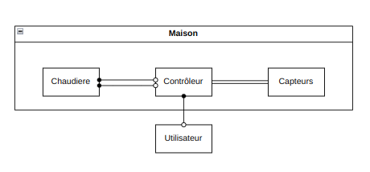
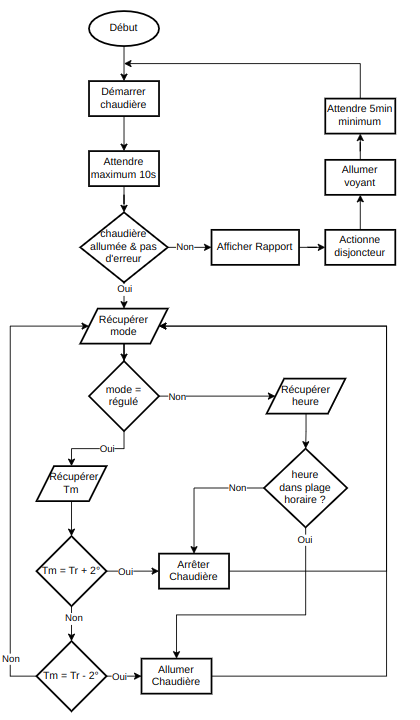

# TP2 Info 802 - Pilotage de la Température dans une Maison

## Conception
### Les architectures utilisées 
- Composants - Connecteurs
- Pipes & Filters 

Pour cette applications, nous avons convenu de l'architecture suivante :


### Les composants
- La chaudière
    + Fonctionne que si le disjoncteur est allumé
    + Fournis les services afin de l'allumer ou de l'éteindre
- Le controlleur
    + Récupère les mesures de température
    + Gère la chaudière en fonction de la température
    + Fournis le service pour changer le mode de fonctionnement
- Le capteur
    + Envoie à intervalle régulier les mesures de température
- L'interface utilisateur
    + Affiche les informations en temps réel

## Réalisation
### Technologies utilisées
Ce projet à été réaliser avec vuejs écrit en typescript.
On voulait avoir la possibilité de voir les informations de l'environnement graphiquement, c'est pourquoi on a décider de créer une interface graphique.
À l'origine, on voulait le réaliser en python avec tkinter pour l'interface, et mqtt pour la communication entre composants. Cependant, un problème de compatibilé entre mqtt et tkinter nous a obligé à changer de technologie. Vous pouvez trouver cet [echec ici](https://github.com/NailykSturm/Info801-TP2-PTM).
C'est pourquoi nous avons donc décidé de réaliser le projet en typescript avec vuejs pour l'interface et socket.io pour la communication entre composants afin de profiter de la des variables dynamiques de vujs pour l'affichage en temps réel.

### Implémentation des concepts

Pour la communication entre les composants, on a utilisé socket.io.
Chaque composant est un client socket.io qui se connecte au serveur socket.io.
Le serveur socket.io enregistre toutes les sockets clients, et pour chaque canal, renvoie les messages reçus à tous les clients connectés.
Pour unifier les mises à jour de l'environnement, il existe un composant `horloge` qui envoie un signal à un interval de temps paramétrable, par le biais d'une socket.

À chaque signal d'horloge, le capteur envoie sa température, et l'interface récupère les informations de l'environnement pour se mettre à jour.

Pour ce qui est du controlleur, on a d'abord réfléchi à ce qu'il devait faire. Suivant l'énnoncé, on est donc arrivé à l'organigramme suivant :  et on l'as implémenté de cette manière.

## Comment lancer le projet
### Installation des dépendances
```
npm install
```
### Lancement du projet en mode développement
En premier lieu, il faut lancer le serveur des sockets :
```
npm run socket_serv_dev
```
Une fois qu'il est lancé, on peut lancer le site web :
```
npm run serve
```
Normalement, le site est accessible à l'adresse suivante : http://localhost:8080/

### Lancement du projet en mode production
Pas encore implémenté

## Utilisation
Sur le site, on peux voir deux parties:
- À gauche : les paramètres divers de l'application
    + Un bouton pour arrêter / reprendre la simulation
    + La plage de travail du controlleur (ne fonctionne qu'en mode programmé)
    + Le mode de fonctionnement du controlleur (régulé ou programmé)
    + La temérature de référence (ne fonctionne qu'en mode régulé)
    + La vitesse de la simulation
    + La probabilité des défaillances qui peuvent survenir
        * Défaillance lors du lancement de la chaudière
        * Défaillance de communication entre la chaudière et le controlleur
- À droite : les informations en temps réel de la simulation
    + L'état de la chaudière
    + L'état du disjoncteur
    + L'heure dans la simulation
    + La liste des dernières mesures de température
    + S'il existe, le rapport d'erreur de démarage de la chaudière