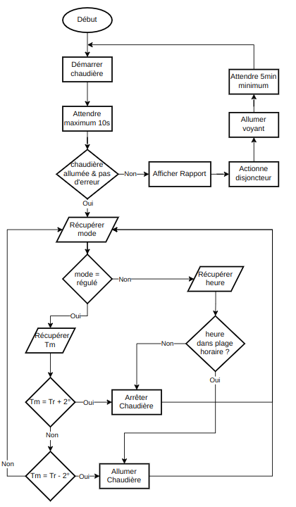

# TP2 Info 802 - Pilotage de la Température dans une Maison

## Conception
### Les architectures utilisées 
- Composants - Connecteurs
- Pipes & Filters 

Nous avons choisi l'architecture suivante pour cette application :


### Les composants
- La chaudière
    + Fonctionne que si le disjoncteur est allumé
    + Fournit les services afin de l'allumer ou de l'éteindre
- Le contrôleur
    + Récupère les mesures de température
    + Gère la chaudière en fonction de la température
    + Fournis le service pour changer le mode de fonctionnement
- Le capteur
    + Envoie à intervalles réguliers les mesures de température
- L'interface utilisateur
    + Affiche les informations en temps réel

## Réalisation
### Technologies utilisées
Ce projet a été réalisé avec VueJS écrit en TypeScript.
Nous nécessitions la possibilité de voir les informations de l'environnement graphiquement, c'est pourquoi on a décidé de créer une interface graphique.
À l'origine, on désirait le réaliser en python avec TKinter pour l'interface, et MQTT pour la communication entre composants. Cependant, un problème de compatibilité entre MQTT et TKinter nous a obligé à changer de technologie. Vous pouvez trouver cet [échec ici](https://github.com/NailykSturm/Info801-TP2-PTM).
C'est pourquoi nous avons donc décidé de réaliser le projet en TypeScript avec VueJS pour l'interface et socket.io pour la communication entre composants afin de profiter des variables dynamiques de VueJS pour l'affichage en temps réel.

### Implémentation des concepts

Pour la communication entre les composants, on a utilisé socket.io.
Chaque composant est un client socket.io qui se connecte au serveur socket.io.
Le serveur socket.io enregistre tous les sockets clients, et pour chaque canal, renvoie les messages reçus à tous les clients connectés.
Pour unifier les mises à jour de l'environnement, il existe un composant `horloge` qui envoie un signal à un intervalle de temps paramétrable, par le biais d'un socket.

À chaque signal d'horloge, le capteur envoie sa température et l'interface récupère les informations de l'environnement pour se mettre à jour.

Pour ce qui est du contrôleur, on a d'abord réfléchi à ce qu'il devait faire. Suivant l'énoncé, on est donc arrivé à l'organigramme suivant :

 

## Comment lancer le projet
### Installation des dépendances
```
npm install
```
### Lancement du projet en mode développement
Dans un premier temps, lançons le serveur des sockets :
```
npm run socket_serv_dev
```
Une fois ce dernier lancé, effectuer la commande suivante afin de lancer le site web :
```
npm run serve
```
Normalement, le site est accessible à l'adresse suivante : http://localhost:8080/

## Utilisation
Sur le site, on peut voir deux parties :
- À gauche : les divers paramètres de l'application
    + Un bouton pour arrêter / reprendre la simulation
    + La plage de travail du contrôleur (ne fonctionne qu'en mode programmé).
    + Le mode de fonctionnement du contrôleur (régulé ou programmé)
    + La température de référence (ne fonctionne qu'en mode régulé).
    + La vitesse de la simulation
    + La probabilité des défaillances qui peuvent survenir
        * Défaillance lors du lancement de la chaudière
        * Défaillance de communication entre la chaudière et le contrôleur
- À droite : les informations en temps réel de la simulation
    + L'état de la chaudière
    + L'état du disjoncteur
    + L'heure dans la simulation
    + La liste des dernières mesures de température
    + Le rapport d'erreur de démarrage de la chaudière s'il existe